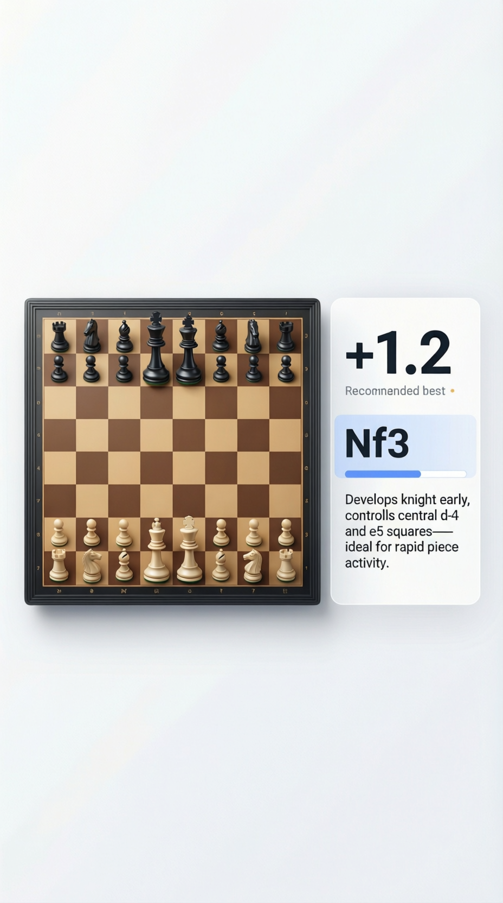

# Blunder Guard


this is an application that uses both expert systems and llm to analyze chess moves and create an apropriate commentray for them.
we use `stockfish` and `qwen3` models to create this pipeline and utilize their strong points to create a robust system.

[lichess database](https://database.nikonoel.fr/)

[llama.cpp](https://github.com/ggml-org/llama.cpp)

# Instalation guide
1. Download the stockfish model from their official page at [here]() and then downloade the llm model from [here](). Then create new `.env` file like [example](.env.example) file and put the models path there.
2. install the python packages in the `requirements.txt` file using this command
```bash
pip install -r requirements.txt
```
3. install the `llama cpp` or use the llama cpp python package **TODO**
4. run the flask app in the inferece dir using this command
```bash
run the flask
```
5. run the gui using this command **TODO**
