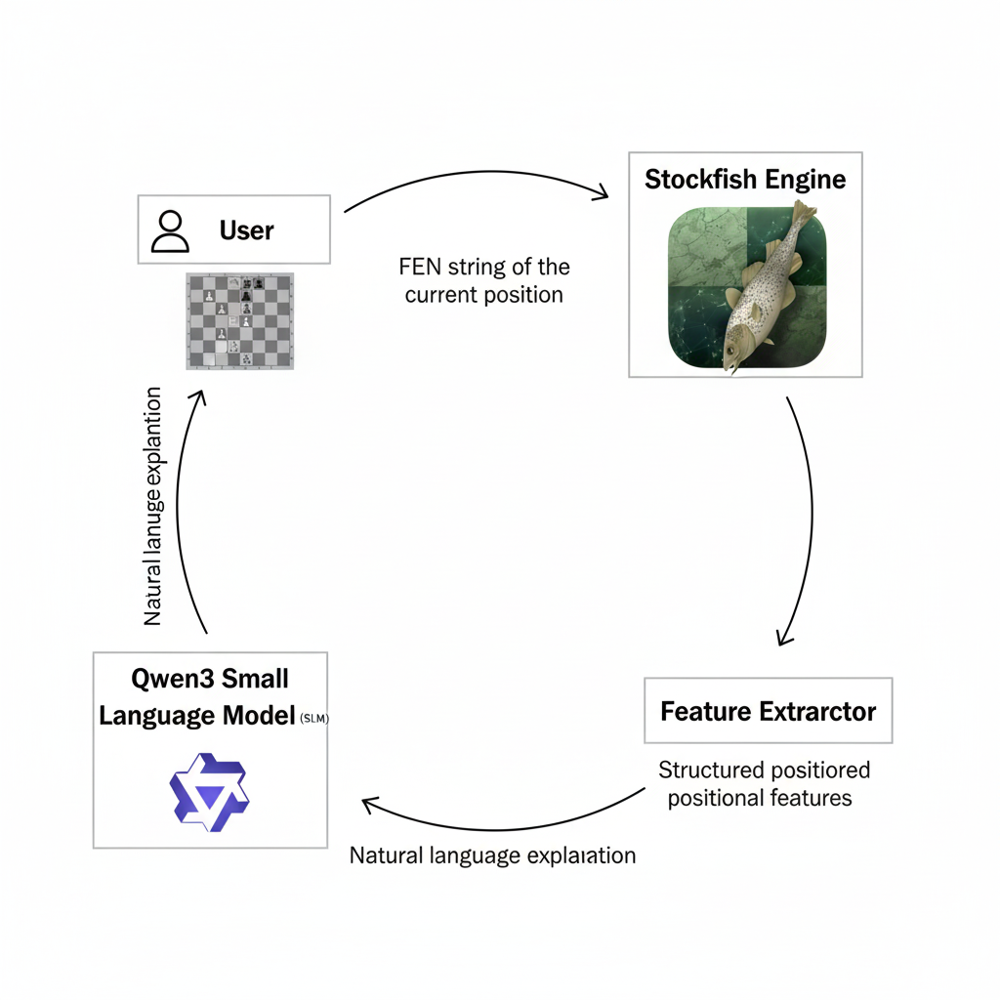
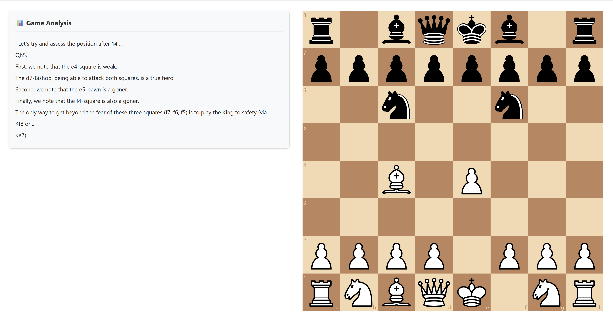

<div align="center">
  
  <h1>Blunder Guard</h1>
</div>

> 🧠 **AI-powered chess commentary** that combines expert analysis from **Stockfish** with natural language generation from a **fine-tuned Qwen3-1.6B model** to explain *why* a move is brilliant, risky, or a blunder — like a grandmaster coach.

Built with:
- 🔍 **Stockfish**: for precise positional and tactical evaluation
- 🤖 **Custom Qwen3-1.6B (LoRA-finetuned + GGUF quantized)**: trained on classical chess literature for domain-aware commentary
- ⚙️ **llama.cpp**: for fast, private, local LLM inference
- 🌐 **React + Flask**: full-stack web app with real-time analysis

**You can see the full report in [docs/Bachelor_Project.pdf](docs/Bachelor_Project.pdf).**


---

## 📦 Installation Guide

### 1. Prerequisites
- Python ≥ 3.10
- Node.js + Bun (for frontend)
- `llama-server` (from [llama.cpp](https://github.com/ggml-org/llama.cpp))

### 2. Clone the Repository
```bash
git clone https://github.com/your-username/blunder-guard.git
cd blunder-guard
```

### 3. Set Up Environment Variables
Create a `.env` file in the root directory based on `.env.example`:
```env
LLM_path=/path/to/qwen3-chess-finetuned.Q4_K_M.gguf
STOCKFISH_PATH=/path/to/stockfish
```

> 💡 **Model Details**  
> - The included LLM is a **Qwen3-1.6B base model**, **finetuned via QLoRA** on curated chess books  to understand strategic concepts, move justification, and blunder classification.  
> - The model was **quantized to GGUF format (Q4_K_M)** using `llama.cpp` tools for efficient CPU/GPU inference with minimal quality loss.  


### 4. Install Python Dependencies
```bash
pip install -r requirements.txt
```

### 5. Install & Build Frontend
```bash
cd frontend
bun install
bun run build
# Output will be in frontend/build/
```

### 6. Install `llama.cpp` (with `llama-server`)
#### Option A: Use Pre-built Binary (Recommended)
Download `llama-server` from the [latest release](https://github.com/ggml-org/llama.cpp/releases) and place it in your `PATH`.

#### Option B: Build from Source
```bash
git clone https://github.com/ggml-org/llama.cpp
cd llama.cpp
make -j llama-server
```

> ✅ Verify installation:
> ```bash
> llama-server --help
> ```

### 7. Run the Application
From the **project root**:
```bash
python run.py
```

The app will:
- Start `llama-server` on **port 8080**
- Launch Flask backend on **port 8000**
- Serve React frontend at `http://localhost:8000`

---

## 🖼️ Screenshot



---

## 📁 Project Structure

```
blunder-guard/
├── app/
│   ├── chess/             # Stockfish analysis and board rendering
│   ├── server.py          # Flask API + static file serving
│   └── chat.py            # LLM integration logic
├── frontend/              # React UI (built with Bun)
├── scripts/               # Dataset and book-processing commands
├── data/
│   ├── raw/               # Source PGN files
│   ├── processed/         # Generated CSV/JSON datasets
│   └── reference/         # Chess books and extracted text
├── evaluation/            # Benchmarks, selections, and judging tools
├── tests/                 # Automated tests
├── artifacts/             # Generated board-analysis images
├── notebooks/             # Exploratory notebooks
├── docs/                  # Thesis and report sources
├── run.py                 # Main entrypoint (starts llama-server + Flask)
├── requirements.txt
├── .env.example
└── README.md
```

Generated images under `artifacts/`, downloaded PGN files under `data/raw/`, and
generated CSV datasets under `data/processed/` are intentionally excluded from
version control. Run repository utilities as modules from the project root, for
example `python -m scripts.generate_dataset` or
`python -m evaluation.aggregate_results`.

LLM-generated candidate datasets include the answer model in their filename:

```text
data/processed/chess_coach_dataset_complete__model_gemini-3.5-flash.csv
```

Evaluate one by passing that CSV explicitly:

```bash
python -m evaluation.judge_responses \
  --input data/processed/chess_coach_dataset_complete__model_gemini-3.5-flash.csv
```

The evaluator derives `answer_model` from the filename and writes
`evaluation/judged__model_gemini-3.5-flash.json` by default. The JSON records
`answer_model` separately from `judge_model`.

---

## 🧪 API Endpoints

| Endpoint      | Method | Description |
|---------------|--------|-------------|
| `/health`     | GET    | Health check |
| `/single`     | POST   | Generate commentary using single-step LLM prompt |
| `/chain`      | POST   | Generate commentary using multi-step reasoning chain |

**Request Body (both endpoints):**
```json
{
  "before": "rnbqkbnr/pppppppp/8/8/8/8/PPPPPPPP/RNBQKBNR w KQkq - 0 1",
  "after": "rnbqkbnr/pppppppp/8/8/4P3/8/PPPP1PPP/RNBQKBNR b KQkq - 0 1"
}
```

---

## 🛠️ Technologies Used

- **Backend**: Python, Flask, python-chess, Stockfish
- **LLM Training**: Qwen3-1.6B + QLoRA on chess theory books → GGUF quantization (Q4_K_M)
- **LLM Inference**: [llama.cpp](https://github.com/ggml-org/llama.cpp) with `llama-server`
- **Frontend**: React, Bun


---

## 🙌 Acknowledgements

- [llama.cpp](https://github.com/ggml-org/llama.cpp) – for enabling efficient local LLM inference
- [Lichess Elite Database](https://database.nikonoel.fr/) – for high-quality training/validation data
- [Stockfish](https://stockfishchess.org/) – the world’s strongest open-source chess engine
- [Qwen Team](https://huggingface.co/Qwen) – for the powerful Qwen3 architecture


<div align="center">
  
</div>
